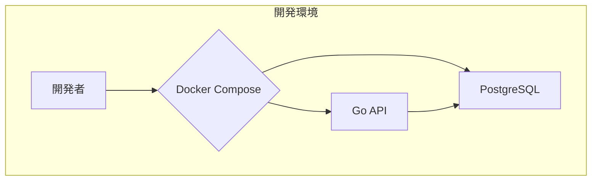

# 🤖 GEMINI.md: AI Code Assistant 向け プロジェクト指針

## 1. プロジェクト概要 (Project Overview)

このプロジェクトは、Go言語および新しいライブラリや技術の検証を目的としたTodoアプリケーションです。将来的にはGCP上での検証もスコープに入れています。

### 1.1. プロジェクトのゴール (Project Goals)

- **検証項目**:
  - Bob (ORM) を用いたデータアクセスパターンの確立
  - kessoku (DI) によるクリーンアーキテクチャの実現性評価
  - OpenTelemetry を用いた分散トレーシングの計測と可視化
- **達成目標**:
  - Cloud Runでの低レイテンシ・高可用なAPIサーバーの構築ノウハウ獲得
  - GitHub Actionsを用いたセキュアなCI/CDパイプラインのベストプラクティスの確立

## 2. 技術スタック (Technology Stack)

### バックエンド (APIサーバー)

- **プログラミング言語**: Go
- **Webフレームワーク**: Gin
- **データベース**: PostgreSQL
- **ORM**: Bob
- **依存性注入**: kessoku
- **テスト/モック**: testing (標準), testify, mockery
- **ロギング**: zerolog
- **環境変数管理**: caarlos0/env
- **バリデーション**: go-playground/validator
- **APIドキュメンテーション**: swaggo/swag

### フロントエンド

- **フレームワーク**: 未定 (ReactまたはVueを検討中)

### インフラストラクチャ (参考)

- **クラウド**: GCP
- **コンテナ実行環境**: Cloud Run
- **データベース**: Cloud SQL for PostgreSQL
- **コンテナレジストリ**: Artifact Registry
- **ロードバランシング**: Cloud Load Balancing

## 3. 開発・運用ツール (Development & Operations Tools)

- **タスクランナー**: make
- **コンテナ化**: Docker, Docker Compose
- **リンター**: golangci-lint
- **CI/CD**: GitHub Actions
- **シナリオテスト**: runn
- **脆弱性診断**: trivy
- **DBドキュメンテーション**: tbls
- **DBマイグレーション**: atlas
- **依存関係更新**: Renovate
- **ローカル環境変数管理**: direnv
- **CLIツール管理**: aqua
- **Gitフック管理**: lefthook
- **負荷テスト**: k6
- **オブザーバビリティ**: OpenTelemetry

## 4. アーキテクチャ概要 (Architecture Overview)

### システム構成図 (参考)

### ディレクトリ構成

- [Standard Go Project Layout](https://github.com/golang-standards/project-layout) を基本とする。

### ER図 (ER Diagram) (参考)

あとで書く

### APIエンドポイント (参考)

- **タスク一覧取得**: `GET /todos`
- **タスク作成**: `POST /todos`
- **タスク詳細取得**: `GET /todos/{id}`
- **タスク更新**: `PUT /todos/{id}`
- **タスク削除**: `DELETE /todos/{id}`

## 5. 主要なコマンド (Key Commands)

- **開発環境のセットアップ**: `git clone <URL>`, `cd <dir>`, `aqua i`, `direnv allow`
- **開発環境の起動**: `make up`
- **開発環境の停止**: `make down`
- **DBマイグレーション**: `make migrate-up`

開発でよく使うコマンドは `Makefile` に定義します。(今後作成)

- **アプリケーションのビルド**: `make build`
- **アプリケーションの実行**: `make run`
- **テストの実行**: `make test`
- **Swaggerドキュメントの生成**: `make swagger`

## 6. コーディング規約・ルール (Coding Conventions & Rules)

- **コミットメッセージ**: Conventional Commits v1.0.0 に準拠する。
- **エラーハンドリング**: `errors.Wrap` などを用いてコンテキストを付与する。
- **命名規則**: Goの慣習に従う (Effective Go)。

## 7. AIへの指示 (Instructions for AI)

- 回答は日本語で行ってください。
- フロントエンドとインフラは現在未実装です。バックエンドの実装に集中してください。
- 新しい機能を追加する際は、必ずユニットテストも同時に作成してください。
- AIとの対話時は、必ず`.gemini/TODO.md` に記載されたルールに従ってください。
