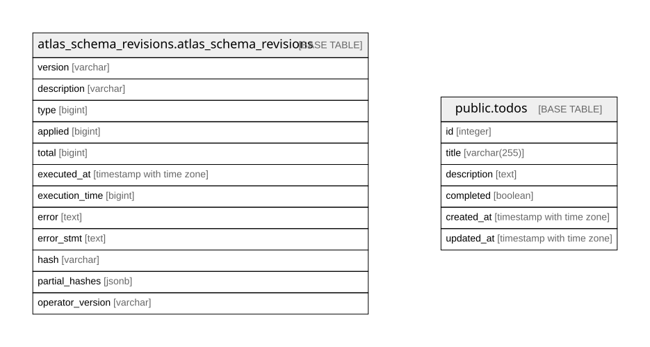

# todo-go

## Tables

| Name | Columns | Comment | Type |
| ---- | ------- | ------- | ---- |
| [atlas_schema_revisions.atlas_schema_revisions](atlas_schema_revisions.atlas_schema_revisions.md) | 12 |  | BASE TABLE |
| [public.todos](public.todos.md) | 6 |  | BASE TABLE |

## Relations

---

> Generated by [tbls](https://github.com/k1LoW/tbls)
