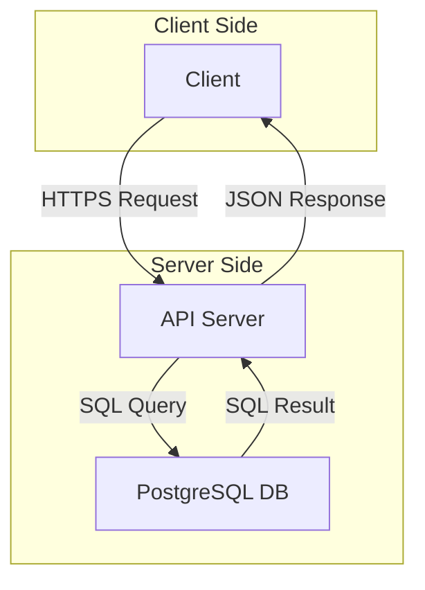

# Todo APIサーバー 基本設計書

| 日付       | バージョン | 変更内容       | 作成者 |
| :--------- | :--------- | :------------- | :----- |
| 2025-11-26 | 1.0        | 初版作成       | Gemini |
| 2025-11-26 | 1.1        | 全体構成を拡張 | Gemini |

## 1. はじめに

### 1.1. 背景と目的

本プロジェクトは、Go言語および新しいライブラリや技術の検証を目的としたTodoアプリケーションの開発を行う。
本書は、そのバックエンドとして機能するTodo APIサーバーの基本設計を定めるものである。Todoアイテムの永続化と、クライアントアプリケーションへのRESTful APIの提供を主な目的とする。

### 1.2. 本書の対象読者

本書は、以下の読者を対象とする。

- プロジェクト開発者
- コードレビュアー
- プロジェクトマネージャー

## 2. システム概要

### 2.1. システム構成

本システムの全体構成は以下の通り。クライアントからのリクエストはAPIサーバーを経由し、データベースにアクセスする。



### 2.2. 機能一覧

本APIサーバーは、以下の機能を提供する。

- Todoアイテムの作成
- Todoアイテムの一覧取得
- Todoアイテムの個別取得
- Todoアイテムの更新
- Todoアイテムの削除

## 3. 機能要件

### 3.1. APIエンドポイント仕様

ベースURL: `/api/v1`

#### 3.1.1. Todo一覧取得 (`GET /todos`)

- **説明:** 登録されている全てのTodoアイテムを取得する。
- **成功レスポンス (`200 OK`):** Todoアイテムの配列。

#### 3.1.2. Todo新規作成 (`POST /todos`)

- **説明:** 新しいTodoアイテムを作成する。
- **リクエストボディ:** `{"title": "string", "description": "string"}`
- **成功レスポンス (`201 Created`):** 作成されたTodoアイテム。
- **エラーレスポンス (`400 Bad Request`):** `title`が空の場合など。

#### 3.1.3. Todo個別取得 (`GET /todos/{id}`)

- **説明:** 指定されたIDのTodoアイテムを取得する。
- **成功レスポンス (`200 OK`):** 指定されたTodoアイテム。
- **エラーレスポンス (`404 Not Found`):** リソースが存在しない場合。

#### 3.1.4. Todo更新 (`PUT /todos/{id}`)

- **説明:** 指定されたIDのTodoアイテムを更新する。
- **リクエストボディ:** `{"title": "string", "description": "string", "completed": boolean}`
- **成功レスポンス (`200 OK`):** 更新後のTodoアイテム。
- **エラーレスポンス (`404 Not Found`, `400 Bad Request`):** リソースが存在しない場合やバリデーションエラー。

#### 3.1.5. Todo削除 (`DELETE /todos/{id}`)

- **説明:** 指定されたIDのTodoアイテムを削除する。
- **成功レスポンス (`204 No Content`):** なし。
- **エラーレスポンス (`404 Not Found`):** リソースが存在しない場合。

### 3.2. データモデル

APIで送受信されるTodoアイテムのJSONオブジェクト。

```json
{
  "id": integer,
  "title": string,
  "description": string,
  "completed": boolean,
  "created_at": string (RFC3339),
  "updated_at": string (RFC3339)
}
```

### 3.3. エラーハンドリング

APIはHTTPステータスコードを用いてエラー状態を示す。

- `400 Bad Request`: リクエストの形式が不正。
- `404 Not Found`: 指定されたリソースが存在しない。
- `500 Internal Server Error`: サーバー内部で予期せぬエラーが発生。

## 4. 非機能要件

### 4.1. パフォーマンス

- **応答時間:** 全てのAPIエンドポイントにおいて、95パーセンタイルのリクエストが500ミリ秒以内に処理を完了すること。

### 4.2. セキュリティ

- ORM(Bob)を利用し、SQLインジェクションを防止する。
- Ginフレームワークの標準的なセキュリティ機能を利用する。
- 今後の拡張で認証・認可機能を実装する際には、JWTなどのトークンベース認証を検討する。

### 4.3. 可用性と信頼性

- **稼働率:** 99.5%以上の稼働率を目指す。
- **エラーリカバリ:** 予期せぬエラーが発生した場合でも、サーバーはクラッシュせず、エラーレスポンスを返却し、後続のリクエストを処理し続けられること。

### 4.4. 保守性と運用性

- **コード品質:** `golangci-lint`などを利用し、静的解析でコード品質を担保する。
- **ロギング:** 主要な処理の実行やエラー発生時に、構造化されたログを出力する。（詳細はログ設計書で定義）
- **テスト:** `make test`コマンドにより、ユニットテストおよび結合テストを実行可能とする。

## 5. 技術仕様

### 5.1. 技術スタック

- **言語:** Go
- **APIフレームワーク:** Gin
- **ORM:** Bob
- **データベース:** PostgreSQL
- **APIドキュメント:** Swagger

### 5.2. データベーススキーマ

```sql
CREATE TABLE IF NOT EXISTS todos (
    id SERIAL PRIMARY KEY,
    title VARCHAR(255) NOT NULL,
    description TEXT,
    completed BOOLEAN NOT NULL DEFAULT FALSE,
    created_at TIMESTAMP WITH TIME ZONE NOT NULL DEFAULT CURRENT_TIMESTAMP,
    updated_at TIMESTAMP WITH TIME ZONE NOT NULL DEFAULT CURRENT_TIMESTAMP
);
```

### 5.3. ディレクトリ構成

- **`internal/domain/todo/entity`**: `Todo`構造体 (エンティティ)
- **`internal/domain/todo/repository`**: `TodoRepository`インターフェース
- **`internal/usecase/todo`**: 各CRUD操作のビジネスロジック (Usecase)
- **`internal/infrastructure/repository`**: `TodoRepository`の具体的な実装 (DB操作)
- **`internal/presentation/handler`**: Ginの`Context`を処理し、Usecaseを呼び出すハンドラ
- **`internal/presentation/router`**: エンドポイントとハンドラを紐付けるルーター設定

### 5.4. APIドキュメント

コードにSwaggerアノテーションを記述し、`make swagger`コマンドを実行することで、`swagger.json`が生成・更新される。
これにより、APIの仕様を常に最新に保つ。
