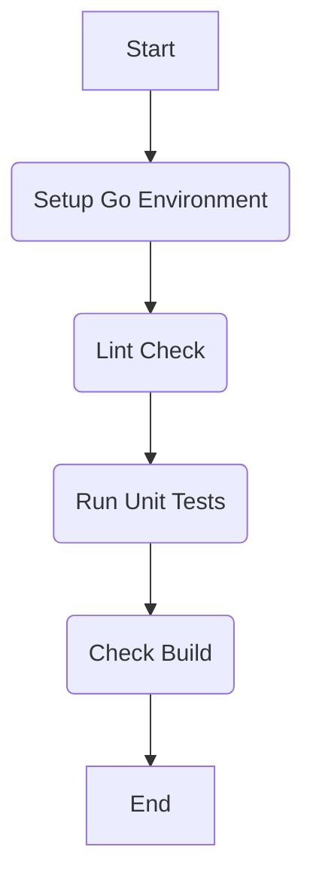

# CI/CD 設計書

## 1. 目的

CI/CDパイプラインを導入し、以下の目的を達成する。

- **Continuous Integration (CI)**: コード変更時にテストと静的解析を自動実行し、品質基準を満たさないコードがマージされるのを防ぐ。開発プロセスの高速化と品質向上を図る。
- **Continuous Delivery (CD)**: CIをパスしたコードを、手動承認を経て、あるいは自動で本番（またはステージング）環境へデプロイする。デプロイ作業の属人化を防ぎ、迅速かつ安全にリリースを行う。

## 2. 使用ツール

- **CI/CDプラットフォーム**: [GitHub Actions](https://github.co.jp/features/actions)

## 3. CI (Continuous Integration) パイプライン

### 3.1. トリガー

- `main` ブランチへのプッシュ
- `main` ブランチをターゲットとしたプルリクエストの作成・更新

### 3.2. ジョブフロー

以下のジョブを順次実行する。いずれかのステップが失敗した場合、パイプラインは失敗する。



1.  **Setup Go Environment**: Go言語の実行環境をセットアップする。
2.  **Lint Check**: `golangci-lint` を実行し、ソースコードの静的解析を行う。
3.  **Run Unit Tests**: `make test` を実行し、単体テストを実行する。コードカバレッジも測定する。
4.  **Check Build**: `make build` を実行し、アプリケーションが正常にビルドできることを確認する。

### 3.3. 実装ファイル（サンプル）

このCIパイプラインは、`.github/workflows/ci.yml` に以下のように記述する。

```yaml
name: CI Pipeline

on:
  push:
    branches: [ main ]
  pull_request:
    branches: [ main ]

jobs:
  build:
    runs-on: ubuntu-latest
    
    defaults:
      run:
        working-directory: ./backend

    steps:
    - name: Checkout code
      uses: actions/checkout@v4

    - name: Set up Go
      uses: actions/setup-go@v5
      with:
        go-version: '1.21'

    - name: Run linter
      uses: golangci/golangci-lint-action@v4
      with:
        working-directory: ./backend
        version: v1.55

    - name: Run unit tests
      run: make test

    - name: Run build
      run: make build
```

## 4. CD (Continuous Delivery) パイプライン (将来的な展望)

### 4.1. トリガー

- `main` ブランチへのタグ付け (`v*.*.*` の形式)

### 4.2. ジョブフロー

CIパイプラインの成功を前提とし、以下のジョブを実行する。

1.  **Authenticate to GCP**: Google Cloudへ認証する。
2.  **Build and Push Docker Image**: アプリケーションのDockerイメージをビルドし、GCPのArtifact Registryにプッシュする。
3.  **Deploy to Cloud Run**: 新しいイメージをCloud Runにデプロイし、トラフィックを切り替える。

このCDパイプラインは、CIとは別のワークフローファイル (`.github/workflows/cd.yml` など) に記述することを想定する。実装にはGCPへの認証情報（Workload Identity連携など）をGitHub ActionsのSecretに登録する必要がある。
