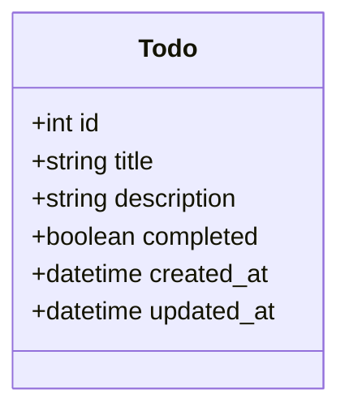

# ドメインモデル図

このドキュメントは、Todo APIシステムのドメインモデルを図で示します。

## 図

ドメインモデルの中心は `Todo` エンティティです。これはアプリケーションで管理されるべき核となるデータ構造を表します。

## 属性の説明

- **id**: Todo項目を一意に識別するためのID。
- **title**: Todoのタイトル。
- **description**: Todoの詳細な説明。
- **completed**: Todoが完了したかどうかを示す状態。
- **created_at**: Todoが作成された日時。
- **updated_at**: Todoが最後に更新された日時。
