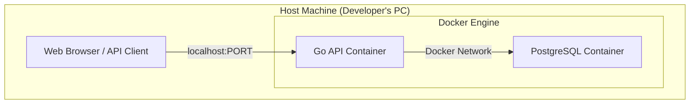
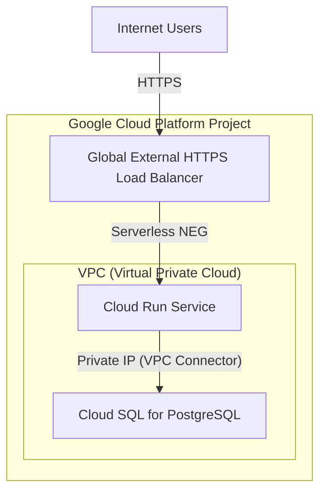

# インフラ・ネットワーク構成図

このドキュメントは、Todo APIサーバーが動作するインフラストラクチャおよびネットワークの構成を図示する。

## 1. ローカル開発環境

ローカルでの開発は、Dockerおよびdocker-composeを用いて環境を構築する。

### 説明
- `docker-compose up`コマンドにより、Goで実装されたAPIサーバーとPostgreSQLデータベースのコンテナが起動する。
- 2つのコンテナは、Dockerが作成する仮想ネットワークブリッジを介して通信する。
- 開発者はホストマシンのブラウザやAPIクライアントから`localhost`を通じてAPIコンテナにアクセスする。

## 2. GCPデプロイ想定構成

将来的にGCPへデプロイする場合の、サーバーレスコンポーネントを中心とした構成案。

### 説明
- **Cloud Load Balancing**: 外部からのHTTPSリクエストを受け付けるグローバルなロードバランサ。SSL証明書の管理や、CDN(Cloud CDN)との連携も可能。
- **Cloud Run**: APIサーバー本体をデプロイする、フルマネージドなサーバーレス環境。リクエスト数に応じて自動でスケールする。
- **Cloud SQL for PostgreSQL**: フルマネージドなPostgreSQLデータベースサービス。バックアップやフェイルオーバーが自動化される。
- **VPC Connector**: Cloud RunからVPC内のリソース（ここではCloud SQL）へ、プライベートIPアドレスで安全に接続するために使用する。
- この構成により、高いスケーラビリティと可用性を持ちながら、運用負荷を低減したインフラを実現できる。
