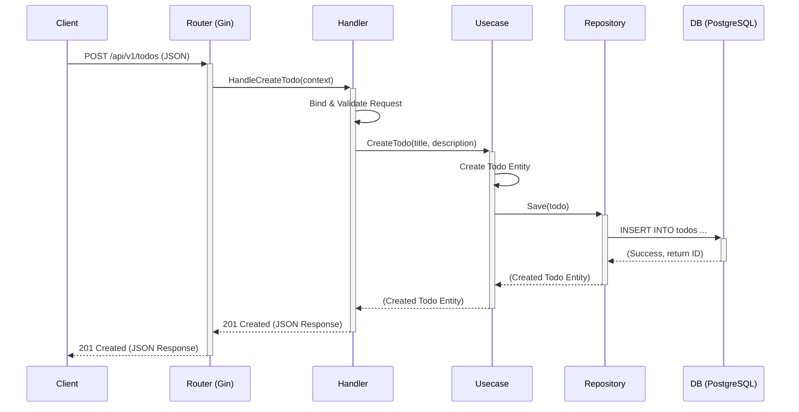
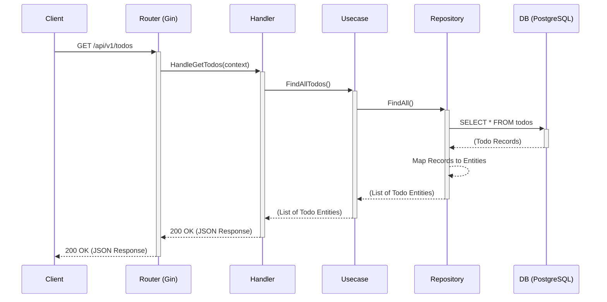

# シーケンス図

このドキュメントは、主要なユースケースにおけるコンポーネント間のインタラクションをシーケンス図で示します。

## 1. Todoの新規作成 (`POST /todos`)

この図は、クライアントが新しいTodoを作成するリクエストを送った際の、システム内部の処理の流れを示します。

## 2. Todoの一覧取得 (`GET /todos`)

この図は、クライアントがTodoリスト全体を要求した際の、システム内部の処理の流れを示します。

